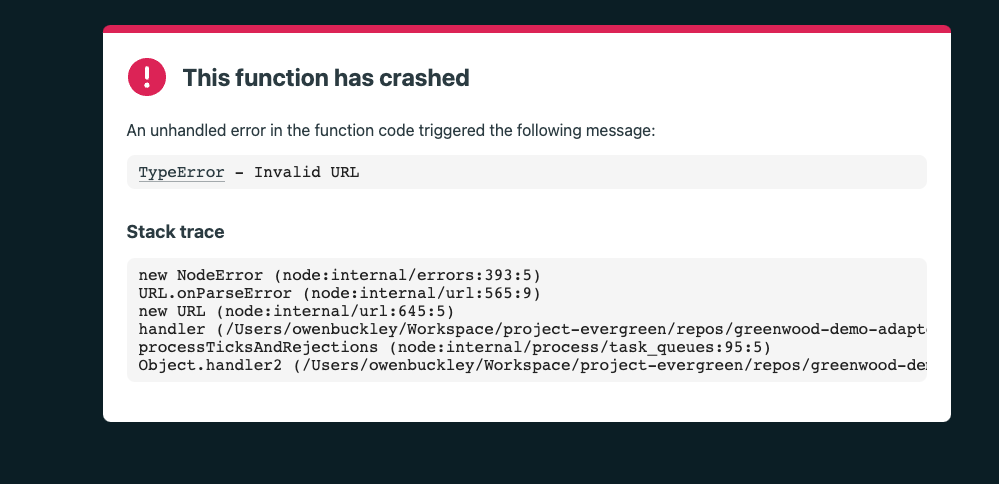
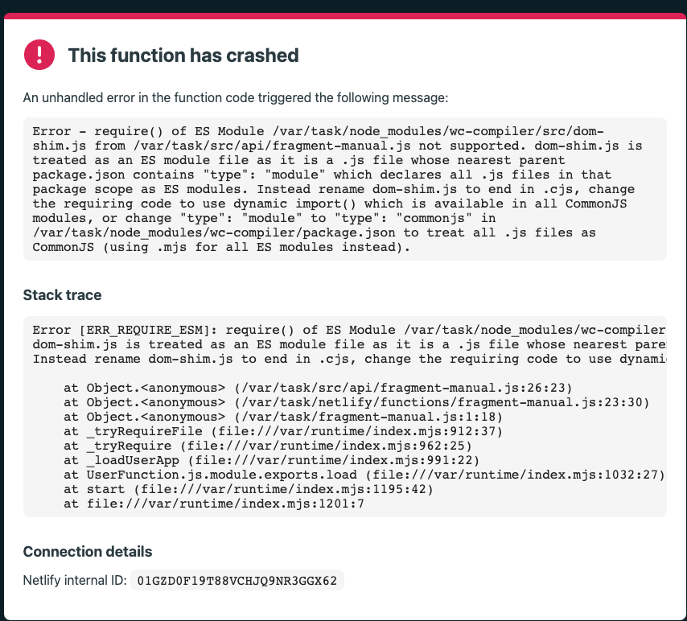

# greenwood-demo-adapter-netlify

[](https://app.netlify.com/sites/harmonious-gaufre-bb14cf/deploys)

> ⚠️ _**Note**: Currently this repo is a WIP_

A demonstration repo for using Greenwood with Netlify Serverless and Edge functions for APIs and SSR pages and used in part of crafting its design for [introducing platform "adapters" into Greenwood](https://github.com/ProjectEvergreen/greenwood/issues/1008).  It also takes reference from [this repo / presentation](https://github.com/thescientist13/web-components-at-the-edge/) for some earlier prototypes for server rendering Web Components.

## Setup

To run locally
1. Clone the repo
1. Run `npm ci`

You can now run these npm scripts
- `npm run dev` - Start the demo with Greenwood local dev server
- `npm run serve` - Start the demo with a production Greenwood build
- `npm run serve:netlify` - Start the Netlify CLI server for testing production Greenwood builds locally (see caveats section in the plugin's README)

> 👉 **Note**: _If deploying to your own Netlify instance, make sure you set the `AWS_LAMBDA_JS_RUNTIME` environment variable [in your Netlify UI](https://answers.netlify.com/t/aws-lambda-js-runtime-nodejs14-x/32161/2) to the value of  `nodejs18.x`_.

## Demo

This repo aims to demonstrate a couple of Greenwood's features ([API Routes](https://www.greenwoodjs.io/docs/api-routes/) and [SSR pages](https://www.greenwoodjs.io/docs/server-rendering/#routes)) leveraging Netlify's serverless and edge function capabilities, focused on using Web Components (WCC) and Web Standards to deliver the content for the demo.

## Status

|Feature    |Greenwood |Serverless|Edge|
|---------- |----------|----------|----|
|API Routes |   ✅     |  ✅      | ❓ |
|SSR Pages  |   ✅     |  ✅      | ❓ |

## Serverless

The serverless demos include the following examples:

### API Routes

- ✅  [`/api/greeting?name{xxx}`](https://harmonious-gaufre-bb14cf.netlify.app/api/greeting) - An API that returns a JSON response and optionally uses the `name` query param for customization.  Otherwise returns a default message.
- ✅  [`/api/fragment`](https://harmonious-gaufre-bb14cf.netlify.app/api/fragment) - An API for returning fragments of server rendered Web Components as HTML, that are then appended to the DOM.  The same card component used in SSR also runs on the client to provide interactivity, like event handling.

### SSR Pages

-  ✅ [`/artists`](https://harmonious-gaufre-bb14cf.netlify.app/artists) - SSR page for rendering Greenwood pages.

### Known Issues

> _**All known issue resolved!  Information left here for posterity**_

####  ✅ import.meta.url

> _**Note**: Solved by [bypassing Netlify's bundling and just creating a zip file custom build output](https://github.com/ProjectEvergreen/greenwood-demo-adapter-netlify/pull/4/commits/7787bc62cb891169a2c8156c0790f648288cab0b)_

Seeing this issue when creating an "idiomatic" example of a custom element using WCC's `renderFromHTML` because [Netlify / esbuild](https://github.com/evanw/esbuild/issues/795) does not support `import.meta.url`, though hopefully it is [coming soon](https://github.com/evanw/esbuild/pull/2508)? 🥺



```js
import { renderFromHTML } from 'wc-compiler';
import { getArtists } from '../services/artists.js';

export async function handler(request) {
  const params = new URLSearchParams(request.url.slice(request.url.indexOf('?')));
  const offset = params.has('offset') ? parseInt(params.get('offset'), 10) : null;
  const headers = new Headers();
  const artists = await getArtists(offset);
  const { html } = await renderFromHTML(`
    ${
      artists.map((item, idx) => {
        const { name, imageUrl } = item;

        return `
          <app-card
            title="${offset + idx + 1}) ${name}"
            thumbnail="${imageUrl}"
          ></app-card>
        `;
      }).join('')
    }
  `, [
    new URL('../components/card.js', import.meta.url)
  ]);

  headers.append('Content-Type', 'text/html');

  return new Response(html, {
    headers
  });
}
```

The above would be the ideal implementation, so instead have to do something more "manual" for now.
```js
import '../../node_modules/wc-compiler/src/dom-shim.js';
import { getArtists } from '../services/artists.js';
import Card from '../components/card.manual.js';

export async function handler(request) {
  const params = new URLSearchParams(request.url.slice(request.url.indexOf('?')));
  const offset = params.has('offset') ? parseInt(params.get('offset'), 10) : null;
  const headers = new Headers();
  const artists = await getArtists(offset);
  const card = new Card();
  
  card.connectedCallback();

  const html = artists.map((artist) => {
    const { name, imageUrl } = artist;
    return `
      <app-card-manual>
        ${card.getInnerHTML({ includeShadowRoots: true })}

        <h2 slot="title">${name}</h2>
        
      </app-card-manual>
    `;
  }).join('');

  headers.append('Content-Type', 'text/html');

  return new Response(html, {
    headers
  });
}
```

####  ✅ ERR_REQUIRE_ESM

> _**Note**: Solved by [pointing to Greenwood's bundled output in the _public/_ directory](https://github.com/ProjectEvergreen/greenwood-demo-adapter-netlify/pull/1)_

So although this runs fine locally for `/api/fragment-manual`, when run on Netlify, the `ERR_REQUIRE_ESM` message is seen.




## Edge

TODO

### API Routes

TODO

### SSR page

TODO

## Adapter Implementation Thoughts / Questions
1. [x] Do we even need workers for build output?
    - if not, how to make a generic solution?  (make a pure `executeModule` function and run the worker ourselves when needed in dev mode?)
1. [x] Will need to generate the _.netlify/functions_ folder on-demand / as part of the build instead of hardcoding, likely from _manifest.json_
1. [x] For SSR pages, manual is the only option?  That will impact how pages can be built, e.g. manual card, shadow dom, etc and might to be configurable based on if the platform supports `import.meta.url` or not it seems.
    - we can get around this using our own bundling solution - https://docs.netlify.com/functions/deploy/?fn-language=js#custom-build-2
1. [x] How to best manage local dev (runtime "compliance") - mixed support, see caveats section of the plugin's README
    - proxy netlify cli dev option?
    - should use _src/_ or _public/_?  depends on dev vs production mode?  Interestingly, the manual way only worked deployed when using _public/_
    - if esbuild worked w/ `import.meta.url`, we could probably ship unzipped bundles, and then dev would also work?
1. [x] Need to provide custom _netlify.toml_?
1. [x] Make sure to spread all headers / response properties in netlify functions adapter output
1. [ ] SSR pages are bundling into _public/api/_ directory ? 
1. [ ] Keep it as an experimental feature for 1.0 (or per platform?)